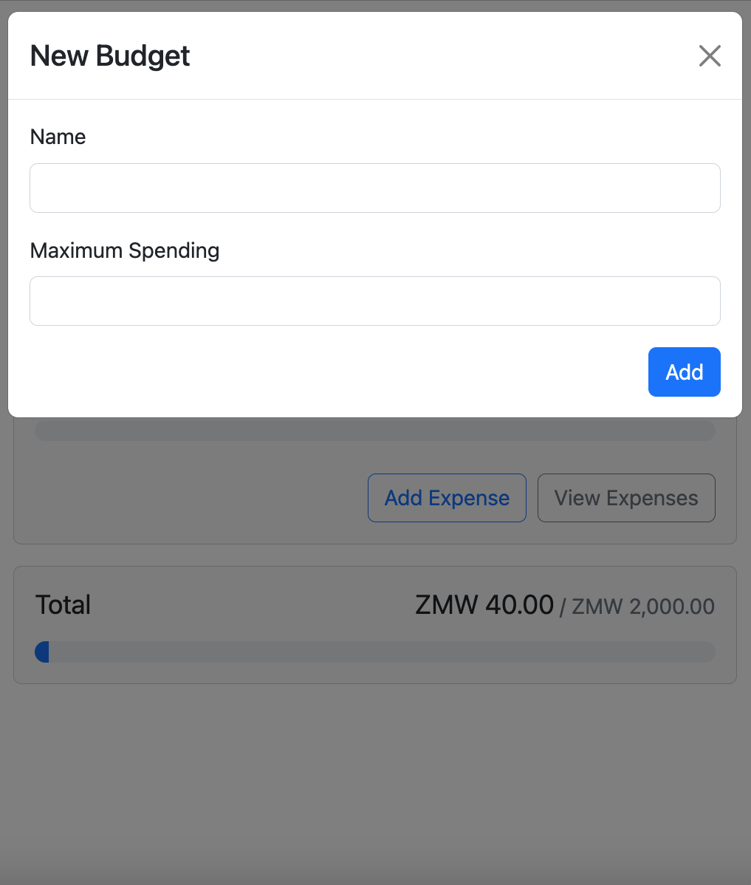

## Budget Apps

This project is a collection of React budget apps that use React.js and Node.js to build personal finance applications. These applications are designed to help individuals and businesses manage their finances by providing tools to track expenses, create budgets, and analyze spending patterns.

The purpose of these projects is to help developers learn and practice using React.js and Node.js to build full-stack personal finance applications. They typically include features such as user authentication, data visualization, and API integration, and may incorporate other popular technologies like Redux and Firebase or MongoDB.

By working on these projects, developers can gain hands-on experience with building complex web applications using modern tools and techniques. They can also learn about best practices for designing and implementing user interfaces, managing state, and handling server-side logic.

Overall, a collection of React budget apps can be a valuable resource for developers looking to expand their skills and build practical, real-world applications.

### Collection

#### 1. Budget Planner

  

#### 2. Budget App

  

  

  

  

#### 3. Income Expense Tracker

  

#### 4. Account Balance App

  

  

  

